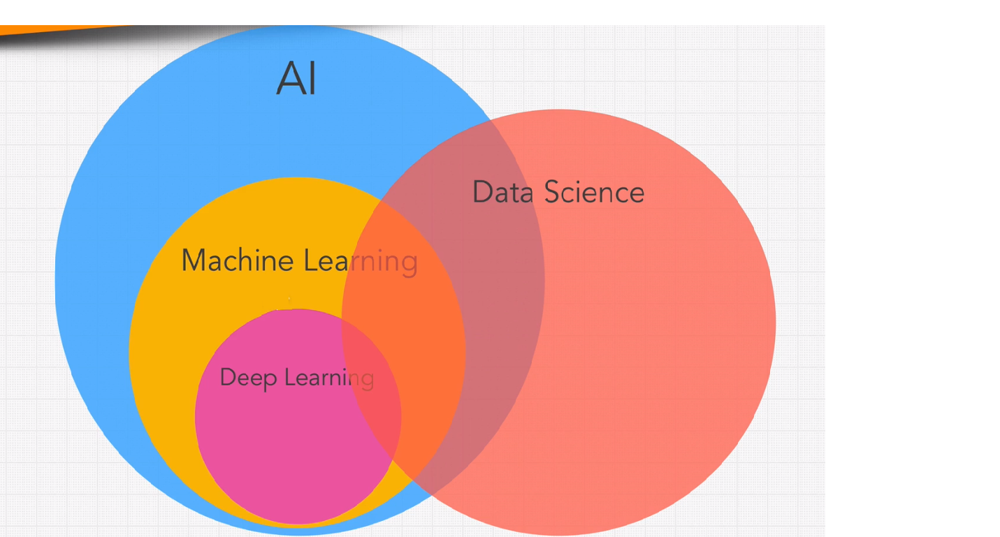

# Complete Python Developer 

## Sections

- [Introduction](#introduction)
- [Python basics I](#python-basics-i)
- [Python basics II](#python-basics-ii)
- [Developer Environment](#developer-environment)
- [Functional programming](#functional-programming)
- [Decorators](#decorators)
- [Error](#error)
- [Generator](#generator)
- [Modules](#modules)
- [Debugging](#debugging)
- [IO](#io)
- [Regular expression](#regular-expression)
- [Testing](#testing)
- [Scripting](#scripting)
- [Web Scrapting](#web-scrapting)
- [Web development](#web-development)
- [Automation](#automation)
- [AI and Machine Learning](#ai-and-machine-learning)

### Introduction
[Classroom](https://discord.gg/nVmbHYY)
[Newletters](https://zerotomastery.io/blog/?tag=PM)

### AI and Machine Learning
- AI: human intelligence exhibited by machines

    

- Machine learning: a subset of AI., an approach to try to achieve artificial intellegence through systems that can find patterns in a set of data.

    

- Machine learning: the science of getting computers act without being explicitly programmed that is getting machines to do things without us specifically saying.
    
    

    -  Type of ML
    
    

- Deep neural networks: one of techniques for implementing machine learning. a type of algorithm.
